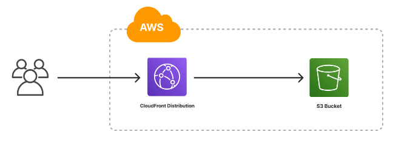

# AWS CloudFront and S3 Secure Static Website Hosting

This project demonstrates how to securely host a static website using AWS CloudFront and an S3 bucket. The S3 bucket is kept private, and content is served through CloudFront.

## Project Overview

* Set up an AWS CloudFront distribution.
* Configured a private S3 bucket to store website content.
* Used CloudFront to securely serve the content from the private S3 bucket.

Below is the architecture diagram for the project setup:

## Steps to Set Up the Project

### 1. Create a Private S3 Bucket

* Go to the AWS S3 console.
* Create a new bucket and ensure it is private.
* Upload your static website files (e.g., `index.html`) & folders to this bucket.

### 2. Create a CloudFront Distribution

* Navigate to the CloudFront console and create a new distribution.
* Set the origin to the S3 bucket created in the previous step.
* Under "Origin Settings," enable "Origin Access Control" to prevent direct access to the S3 bucket.

### 3. Configure S3 Bucket Policy

* Once the CloudFront distribution is created, you'll be provided with a policy to attach to the S3 bucket.
* Go to the S3 bucket permissions and edit the bucket policy to allow access from CloudFront.

### 4. Test the Setup

* Access your CloudFront distribution URL to ensure the static website is being served correctly.
* Ensure that direct access to the S3 bucket URL is denied.

## Conclusion

By following these steps, you can securely serve a static website using AWS CloudFront and a private S3 bucket, ensuring that your content is protected while being efficiently delivered to users.
